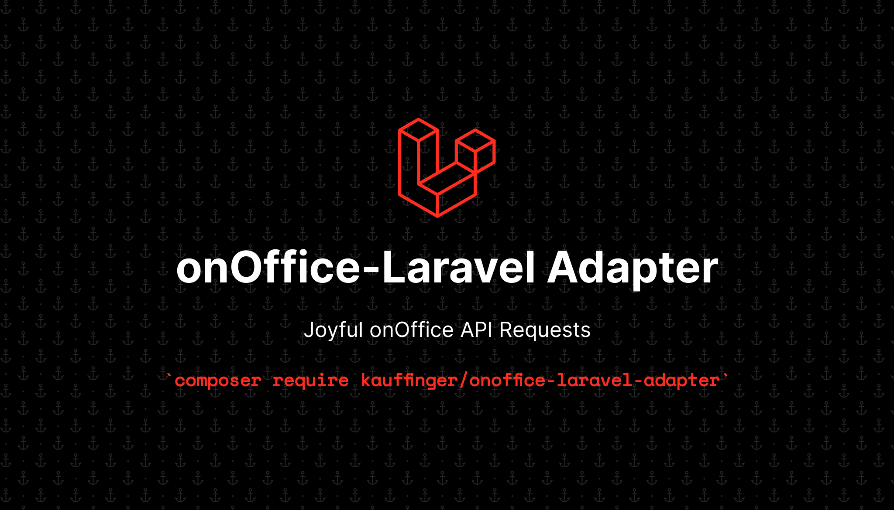

# A joyful way to interact with the onOffice API using Laravel and Saloon.

[](https://packagist.org/packages/kauffinger/onoffice-laravel-adapter)
[](https://github.com/kauffinger/onoffice-laravel-adapter/actions?query=workflow%3Arun-tests+branch%3Amain)
[](https://github.com/kauffinger/onoffice-laravel-adapter/actions?query=workflow%3A"Fix+PHP+code+style+issues"+branch%3Amain)
[](https://packagist.org/packages/kauffinger/onoffice-laravel-adapter)

This is a package meant to make interacting with the onOffice API enjoyable and easy. We try our best to make all rules from the API as explicit as possible in code. This means you shouldn't be able to create invalid requests.
It is based on the [official php sdk](https://github.com/onOfficeGmbH/sdk) and [saloon](https://github.com/saloonphp/saloon).



## Installation

You can install the package via composer:

```bash
composer require kauffinger/onoffice-laravel-adapter
```

You can publish the config file with:

```bash
php artisan vendor:publish --tag="onoffice-laravel-adapter-config"
```

This is the contents of the published config file:

```php
return [
    'token' => env('ON_OFFICE_TOKEN'),
    'secret' => env('ON_OFFICE_SECRET'),
    'base_url' => env('ON_OFFICE_BASE_URL', 'https://api.onoffice.de/api/stable/api.php'),
];
```

## Usage

```php
$api = new OnOfficeApi(config('onoffice.token'), config('onoffice.secret'));
$request = new OnOfficeApiRequest();
$request->addAction(
    Action::read()
        ->address()
        ->formatOutput()
        ->outputInLanguage(Language::German)
        ->addMobileUrl()
        ->fieldsToRead('phone', 'mobile')
        ->setListLimit(200)
);

$response = $api->send($request);
```

Or, if you like your code even cleaner, how about this:

```php
$request = OnOfficeApiRequest::with(
    Action::read()
        ->task()
        ->fieldsToRead('Eintragsdatum', 'modified')
        ->setRelatedEstateId(2)
        ->setRelatedProjectId(1)
        ->setListLimit(200)
);

$response = OnOfficeApi::for(
    config('onoffice.token'), config('onoffice.secret')
)
    ->send($request);
```

## Features

-   Access all onOffice API endpoints in a way that is as typesafe as possible (in progress)
-   Integrate optional saloon based [caching](https://docs.saloon.dev/official-plugins/caching-responses) of requests (todo)
-   Add saloon resource classes for the most used basic actions (todo)

## Testing

```bash
composer test
```

## Changelog

Please see [CHANGELOG](CHANGELOG.md) for more information on what has changed recently.

## Contributing

Please see [CONTRIBUTING](CONTRIBUTING.md) for details.

## Security Vulnerabilities

Please review [our security policy](../../security/policy) on how to report security vulnerabilities.

## Credits

-   [Konstantin Auffinger](https://github.com/kauffinger)
-   [All Contributors](../../contributors)

## License

The MIT License (MIT). Please see [License File](LICENSE.md) for more information.
